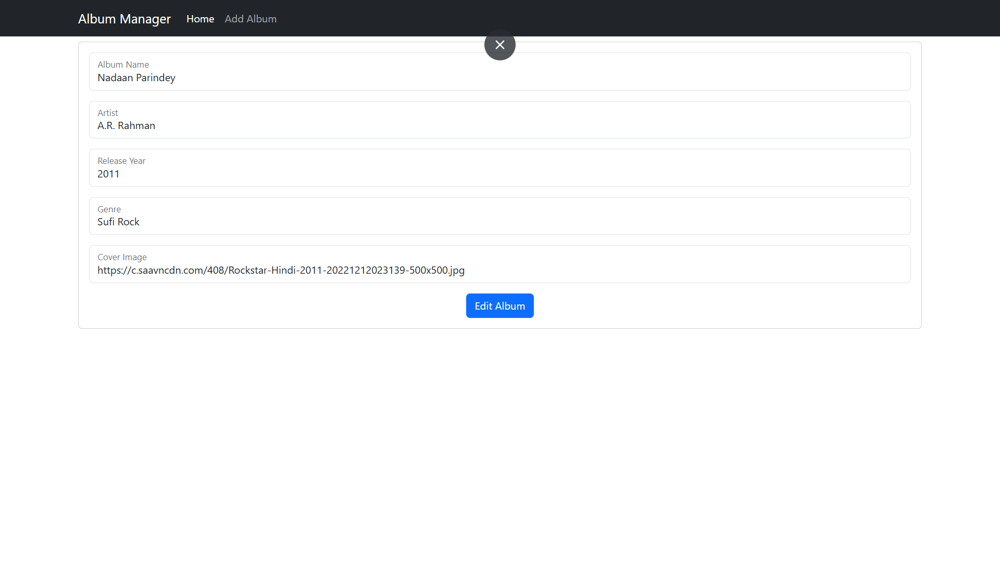
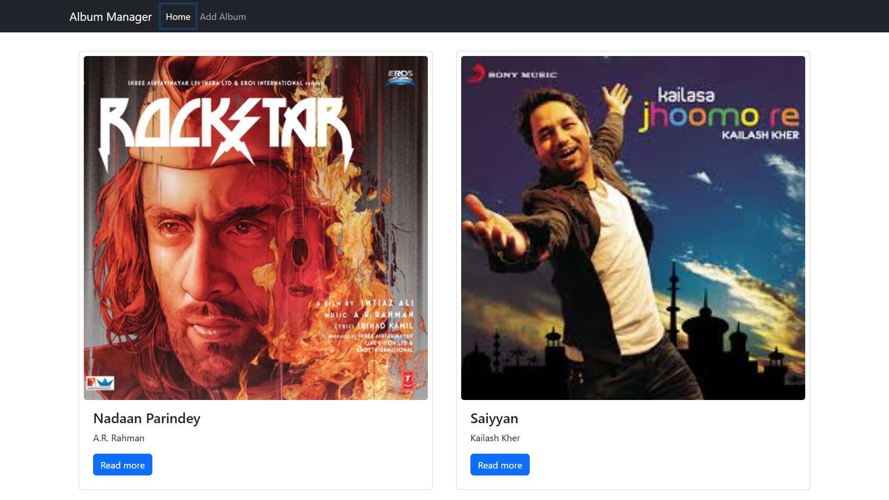
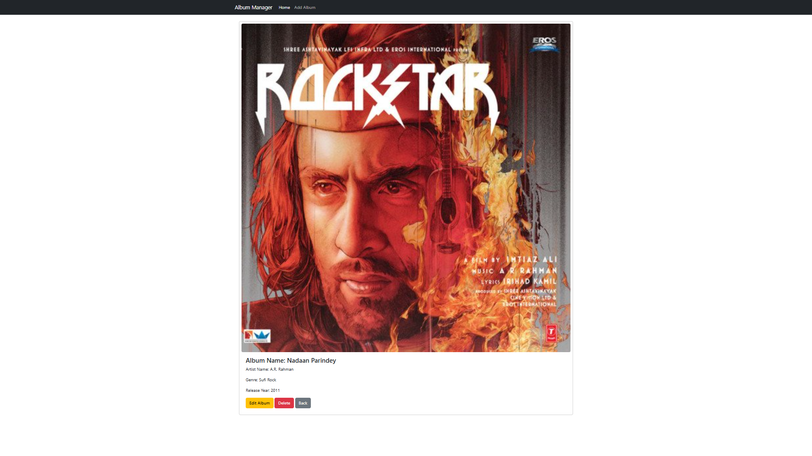

# music-app-react
MERN App performing CRUD on Music Albums 

🚀 Tech Stack

# Frontend:

React.js

Vite

Axios

CSS / Tailwind (if used)

# Backend:

Node.js

Express.js

MongoDB

Mongoose

📌 Features

➕ Add new songs/albums

📖 View all music records

✏️ Update existing records

❌ Delete songs/albums

🔍 RESTful API integration

🌐 Full-stack CRUD functionality

📷 Screenshots
- Add

- Edit

- Home

- Show
